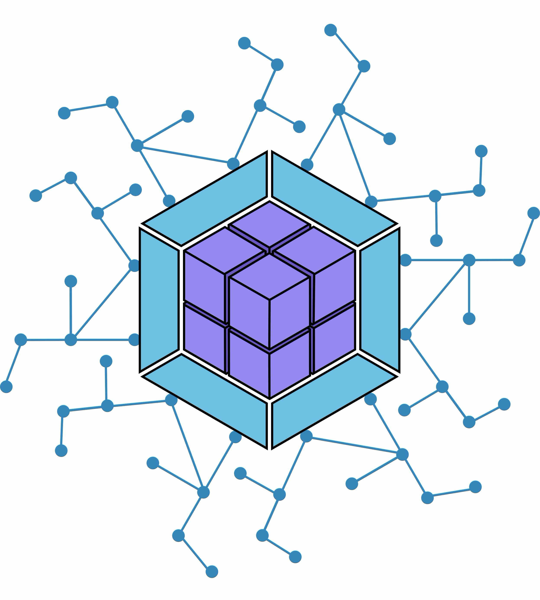
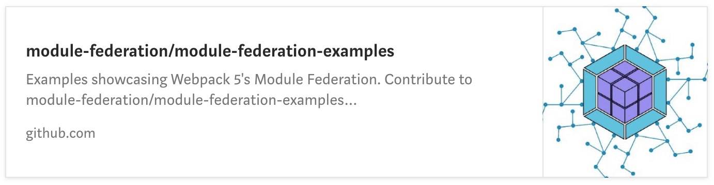

# Webpack 5 Module Federation: JavaScript 架构的变革者

Module Federation <code style="font-family: Arail"><i>[ˌfedəˈreɪʃn]</i></code> 使 JavaScript 应用得以在客户端或服务器上动态运行另一个 bundle 或者 build 的代码。

> 原文：[Webpack 5 Module Federation: A game-changer in JavaScript architecture](https://medium.com/@ScriptedAlchemy/webpack-5-module-federation-a-game-changer-to-javascript-architecture-bcdd30e02669)

---

**Module Federation 之于 JavaScript Bundler，如同 Apollo 之于 GraphQL。**

> 在独立的应用之间共享代码的可伸缩解决方案从未如此方便，而且几乎不可能大规模实现。此前我们拥有的最成熟方案是 externals 或 DLLPlugin，它们强制把依赖集中于一个外部文件中。共享代码真的很麻烦，因为很多应用看似独立，却不是真正意义上的独立，可共享的依赖非常有限。此外，在单独打包的 Web 应用之间共享实际的特性代码往往并不可行、**无效**、且毫无益处。

## 那么什么是 Module Federation?

这是我发明并且赋予它最初形态的 JavaScript 架构，在我的联合创作者兼 Webpack 创始人的帮助下，它成为了 Webpack 5 Core 中最令人兴奋的功能之一（Webpack 5 有一堆很酷的东西，新的 API 强大又干净）。

<Highlight>

我非常荣幸地向大家介绍 JavaScript 应用架构中的一个期待已久的飞跃，我们对于开源社区的贡献：Module Federation。

</Highlight>

Module Federation 使 JavaScript 应用得以从另一个 JavaScript 应用中动态地加载代码 —— 同时共享依赖。如果某应用所消费的 federated module 没有 federated code 中所需的依赖，Webpack 将会从 federated 构建源中下载缺少的依赖项。

代码是可以共享的，但每种情况都有降级方案。federated code 可以总是加载自己的依赖，但在下载前会去尝试使用消费者的依赖。更少的代码冗余，依赖共享就像一个单一的 Webpack 构建。虽然我已经实现了这个最初的系统——他是由我自己（[Zack Jackson](https://medium.com/@ScriptedAlchemy)）和 [Marais Rossouw](https://medium.com/@maraisr) 在 [Tobias Koppers](https://medium.com/@sokra) 的悉心帮助和结对编程下完成的。这些开发者们在 Webpack 5 的核心重写和稳定化上起着关键性的作用，谢谢你们一直以来的合作和支持。

## 术语

<p align="center">
  
</p>

- **Module federation**: 与 Apollo GraphQL federation 的想法相同 —— 但适用于在浏览器或者 Node.js 中运行的 JavaScript 模块。

- **host**：在页面加载过程中（当 `onLoad` 事件被触发）最先被初始化的 Webpack 构建；
 
- **remote**：部分被 **“host”** 消费的另一个 Webpack 构建；

- **Bidirectional（双向的） hosts**：当一个 bundle 或者 webpack build 作为一个 `host` 或 `remote` 运行时，它要么消费其他应用，要么被其他应用消费——均发生在运行时(runtime)。

如果你想更好地理解这篇文章，欢迎阅读[Jack Herrington](https://medium.com/@jherr) 写的文章!

<p align="center">
  <iframe width="100%" height="315" src="https://www.youtube.com/embed/D3XYAx30CNc" frameborder="1" allow="accelerometer; autoplay; encrypted-media; gyroscope; picture-in-picture" allowfullscreen></iframe>
</p>

<Highlight>

值得注意的是，该系统的设计使每个完全独立的构建/应用都可以存放在自己的仓库中，独立部署，并作为独立的 SPA 运行。

</Highlight>

这些应用都是 **bidirectional（双向的） hosts**. 所有在你修改路由或者移动应用时率先加载的应用都将成为 host, 它会像你实现 dynamic imports 一样加载 federated modules. 不过，如果你要刷新页面，则任何在之后的 load 中率先启动的应用，都将成为一个 host。

<CardLink>
  <a target="_blank" href="https://twitter.com/kmsaldana1/status/1234551387398103043?ref_src=twsrc%5Etfw%7Ctwcamp%5Etweetembed&ref_url=https%3A%2F%2Fcdn.embedly.com%2Fwidgets%2Fmedia.html%3Ftype%3Dtext%252Fhtml%26key%3Da19fcc184b9711e1b4764040d3dc5c07%26schema%3Dtwitter%26url%3Dhttps%253A%2F%2Ftwitter.com%2Fkmsaldana1%2Fstatus%2F1234551387398103043%26image%3Dhttps%253A%2F%2Fi.embed.ly%2F1%2Fimage%253Furl%253Dhttps%25253A%25252F%25252Fpbs.twimg.com%25252Fprofile_images%25252F1016423846809722880%25252FJyBot7JY_400x400.jpg%2526key%253Da19fcc184b9711e1b4764040d3dc5c07">
    
  </a>
</CardLink>

假设一个网站的每个页面都是独立部署和编译的，我想要这种微前端风格的架构，但不希望页面随着我更改路由而重新加载。我还希望在页面之间动态地共享代码和 vendors, 这样它就像支持 code splitting 的大型 Webpack 构建般高效了。

</Highlight>


访问应用的 home 也将会使这个 “home” 页成为 “host”，如果你切换到 “about” 页，那么这个 host（home 页的 spa）实际上是从另一个独立应用（about 页的 spa）中动态加载一个模块，它并不会加载应用主入口以及另一个完整的应用，**而只会加载几千字节的代码**。如果我在 “about” 页刷新浏览器，“about” 页将会成为 “host”，此时我回到 “home” 页，“about” 页（“host”）将会从 “remote” 获取运行时的一些片段——这个 “remote” 就是 “home” 页。在这个系统中，所有的应用都既是 “remote” 又是 “host”，与其它 federated module 互为消费者与被消费者。

你可以在 Github 上找到更多的技术细节：

[Merge Proposal: Module federation and code sharing between bundles. Many builds act as one](https://medium.com/@ScriptedAlchemy/webpack-5-module-federation-a-game-changer-to-javascript-architecture-bcdd30e02669)

## 构建一个 federated application

让我们从三个独立的应用入手。

### App One

#### 配置

我将使用 **App One** 中的应用容器 `<App>`，它将会被另一个应用消费，为此，我把 App expose 为 AppContainer，**App One** 将会同时消费来自另外两个 federated applications 中的组件，为此，我指定了 `remotes` scope：

```js
const HtmlWebpackPlugin = require("html-webpack-plugin");
const ModuleFederationPlugin = require("webpack/lib/container/ModuleFederationPlugin");

module.exports = {
  // other webpack configs...
  plugins: [
    new ModuleFederationPlugin({
      name: "app_one_remote",
      remotes: {
        app_two: "app_two_remote",
        app_three: "app_three_remote"
      },
      exposes: {
        'AppContainer':'./src/App'
      },
      shared: ["react", "react-dom","react-router-dom"]
    }),
    new HtmlWebpackPlugin({
      template: "./public/index.html",
      chunks: ["main"]
    })
  ]
}
```

#### 设定构建编排流程

在应用的头部，我加载了 `app_one_remote.js` —— 来让当前的应用连接到其他 Webpack runtimes，并在运行时提供一个编排层（orchestration layer），这是一个专门设计的 Webpack runtime 和 entry point，**但它不是一个普通的应用 entry point，并且只有几 KB**。

**要注意，这些特殊的 entry points 大小只有几 KB——它们包含一个可以与 host 连接的特殊的 Webpack runtime，它们并非标准的 entry point。**

```html
<head>
  <script src="http://localhost:3002/app_one_remote.js"></script>
  <script src="http://localhost:3003/app_two_remote.js"></script>
</head>
<body>
  <div id="root"></div>
</body>
```

#### 从 remote 消费代码

**App One** 中有个 Page1 页面消费了 **App Two** 的 dialog 组件：

```jsx
const Dialog = React.lazy(() => import("app_two_remote/Dialog"));

const Page1 = () => {
    return (
        <div>
            <h1>Page 1</h1>
            <React.Suspense fallback="Loading Material UI Dialog...">
                <Dialog />
            </React.Suspense>
        </div>
    );
}

export default Page1;
```

路由看起来很标准：

```jsx harmony
import { Route, Switch } from "react-router-dom";

import Page1 from "./pages/page1";
import Page2 from "./pages/page2";
import React from "react";

const Routes = () => (
  <Switch>
    <Route path="/page1">
      <Page1 />
    </Route>
    <Route path="/page2">
      <Page2 />
    </Route>
  </Switch>
);

export default Routes;
```

<CardLink>
  <a target="_blank" href="https://twitter.com/ScriptedAlchemy/status/1233646967944646657?ref_src=twsrc%5Etfw%7Ctwcamp%5Etweetembed&ref_url=https%3A%2F%2Fcdn.embedly.com%2Fwidgets%2Fmedia.html%3Ftype%3Dtext%252Fhtml%26key%3Da19fcc184b9711e1b4764040d3dc5c07%26schema%3Dtwitter%26url%3Dhttps%253A%2F%2Ftwitter.com%2Fscriptedalchemy%2Fstatus%2F1233805740076224514%26image%3Dhttps%253A%2F%2Fi.embed.ly%2F1%2Fimage%253Furl%253Dhttps%25253A%25252F%25252Fpbs.twimg.com%25252Fprofile_images%25252F1006614185093091337%25252FOAPr0bpP_400x400.jpg%2526key%253Da19fcc184b9711e1b4764040d3dc5c07">
  
 </a>
</CardLink>

### App Two

#### 配置


**App Two** 将会导出 Dialog，并让 **App One** 来消费它，**App Two** 将会同时消费 **App One** 的 `<App>` —— 因此我们把 `app_one` 页设置为 “remote”。演示一下 bi-directional hosts.

```js
const HtmlWebpackPlugin = require("html-webpack-plugin");
const ModuleFederationPlugin = require("webpack/lib/container/ModuleFederationPlugin");
module.exports = {
  plugins: [
    new ModuleFederationPlugin({
      name: "app_two_remote",
      library: { type: "var", name: "app_two_remote" },
      filename: "remoteEntry.js",
      exposes: {
        Dialog: "./src/Dialog"
      },
      remotes: {
        app_one: "app_one_remote",
      },
      shared: ["react", "react-dom","react-router-dom"]
    }),
    new HtmlWebpackPlugin({
      template: "./public/index.html",
      chunks: ["main"]
    })
  ]
};
```

#### 消费

这个是根 `App`：

```jsx harmony
import React from "react";
import Routes from './Routes'
const AppContainer = React.lazy(() => import("app_one_remote/AppContainer"));

const App = () => {
    return (
        <div>
            <React.Suspense fallback="Loading App Container from Host">
                <AppContainer routes={Routes}/>
            </React.Suspense>
        </div>
    );
}

export default App;
```

这个是使用了 `Dialog` 的默认页面：

```jsx harmony
import React from 'react'
import {ThemeProvider} from "@material-ui/core";
import {theme} from "./theme";
import Dialog from "./Dialog";

function MainPage() {
    return (
        <ThemeProvider theme={theme}>
            <div>
                <h1>Material UI App</h1>
                <Dialog />
            </div>
        </ThemeProvider>
    );
}

export default MainPage
```

### App Three

正如所料，**App Three** 看起来（和**App Two**）很相似。但是，它不消费来自 **App one** 的独立自运行的组件 `<App>` （没有导航栏或侧边栏），因此，它并未指定任何 “remote”：

```js
new ModuleFederationPlugin({
  name: "app_three_remote",
  library: { type: "var", name: "app_three_remote" },
  filename: "remoteEntry.js",
  exposes: {
    Button: "./src/Button"
  },
  shared: ["react", "react-dom"]
}),
```

## 浏览器中的最终结果（不同于第一个视频）

请重点关注 network 标签页，来自三个不同服务器的代码正在被整合（federated），三个不同的 bundles，我们一般建议不要 federate 整个应用的容器，除非你正享受 SSR 或者渐进式加载带来的好处。不管怎么说，这个概念简直太强大了。

<CardLink>
  <a target="_blank" href="https://twitter.com/ScriptedAlchemy/status/1234383702433468416?ref_src=twsrc%5Etfw%7Ctwcamp%5Etweetembed&ref_url=https%3A%2F%2Fcdn.embedly.com%2Fwidgets%2Fmedia.html%3Ftype%3Dtext%252Fhtml%26key%3Da19fcc184b9711e1b4764040d3dc5c07%26schema%3Dtwitter%26url%3Dhttps%253A%2F%2Ftwitter.com%2Fscriptedalchemy%2Fstatus%2F1234383702433468416%26image%3Dhttps%253A%2F%2Fpbs.twimg.com%2Fext_tw_video_thumb%2F1234383371863617536%2Fpu%2Fimg%2FlQ-uregGFW3TExzi.jpg">
    
  </a>
</CardLink>

### 代码冗余

这里几乎没有任何依赖冗余，通过 `shared` 选项 —— **remotes 将会首先依赖来自 host 的依赖，如果 host 没有依赖，它将会下载自己的依赖。没有代码层面的冗余，而只有内置的冗余。**

<CardLink>
 <a target="_blank" href="https://twitter.com/ScriptedAlchemy/status/1233996827814322178?ref_src=twsrc%5Etfw%7Ctwcamp%5Etweetembed&ref_url=https%3A%2F%2Fcdn.embedly.com%2Fwidgets%2Fmedia.html%3Ftype%3Dtext%252Fhtml%26key%3Da19fcc184b9711e1b4764040d3dc5c07%26schema%3Dtwitter%26url%3Dhttps%253A%2F%2Ftwitter.com%2Fscriptedalchemy%2Fstatus%2F1233996827814322178%26image%3Dhttps%253A%2F%2Fi.embed.ly%2F1%2Fimage%253Furl%253Dhttps%25253A%25252F%25252Fpbs.twimg.com%25252Fprofile_images%25252F1006614185093091337%25252FOAPr0bpP_400x400.jpg%2526key%253Da19fcc184b9711e1b4764040d3dc5c07">
  
  </a>
</CardLink>

然而手动地增加 vendors 或其他用于`共享`的模块并不利于拓展，你可以自定义一个函数或者相应的 Webpack 插件来实现自动化。我们的确计划发布 `AutomaticModuleFederationPlugin`，并且在 Webpack Core 之外去维护它。既然我们在 Webpack 中已经有了相当好的 code federation 支持，拓展它的功能就不值一提了。

那么大问题来了… 上面说的这些支持 SSR 吗？？

<iframe src="https://giphy.com/embed/3oz8xwNlejeJDQREic" width="100%" height="400" frameBorder="0" class="giphy-embed" allowFullScreen></iframe><p></p>

## 服务端渲染

我们将其设计成了可以在任何环境下工作的 “通用模块 Federation”，服务端渲染 federated code 是完全可行的，只要让服务器构建使用一个 `commonjs` 的 library target。实现 federated SSR 有很多种办法，S3 Streaming, ESI, 自动化一个 npm 发布去消费服务器的变化内容，我计划用一个常用的共享文件的 volume 或者移步的 S3 streaming 来跨文件系统传输文件。让服务器能够像在浏览器中一样去 require federated code，使用 fs 而不是 http 来加载 federated code。

```js
module.exports = {
 plugins: [
  new ModuleFederationPlugin({
   name: "container",
   library: { type: "commonjs-module" },
   filename: "container.js",
   remotes: {
    containerB: "../1-container-full/container.js"
   },
   shared: ["react"]
  })
 ]
};
```

<iframe src="https://giphy.com/embed/aNZjVWeD1hBCg" width="100%" height="400" frameBorder="0" class="giphy-embed" allowFullScreen></iframe><p></p>


<Highlight>

“Module Federation 当然也适用于 `target: "node"`，这里使用指向其他微前端应用的文件路径，而不是 URLs。这样的话你就可以用同样的代码，外加不一样的 Webpack 配置来在 Node.js 中实现 SSR. Module Federation 的特性在 Node.js 中保持不变，如独立构建、独立部署。—— Tobias Koppers

</Highlight>

## Federated Next.js on Webpack 5

Federation 依赖 Webpack 5 —— Next 并未官方支持。不过我已经 fork Next.js，并设法升级它以支持 Webpack 5 了！这项工作仍在进行中，还有一些开发模式下的中间件需要完成。生产模式已经搞定了，但某些附加的 loaders 仍然需要重新测试。

[feat: Upgrade Next.js to Webpack 5](https://github.com/module-federation/next.js/pull/2)

<CardLink>
  <a target="_blank" href="https://twitter.com/ScriptedAlchemy/status/1234373741246730241?ref_src=twsrc%5Etfw%7Ctwcamp%5Etweetembed&ref_url=https%3A%2F%2Fcdn.embedly.com%2Fwidgets%2Fmedia.html%3Ftype%3Dtext%252Fhtml%26key%3Da19fcc184b9711e1b4764040d3dc5c07%26schema%3Dtwitter%26url%3Dhttps%253A%2F%2Ftwitter.com%2Fscriptedalchemy%2Fstatus%2F1234373741246730241%26image%3Dhttps%253A%2F%2Fpbs.twimg.com%2Fprofile_images%2F1006614185093091337%2FOAPr0bpP_400x400.jpg">
    
  </a>
</CardLink>

### Talks, podcasts, or feedback


我非常想有和大家分享这项技术的机会，如果你想要使用 `Module Federation` 或者 `Federated architecture`，我们想要听到你的使用经历以及对现有的架构的调整。我们也非常期望能够有机会在 Podcasts、meetups 或者 corporations 中讨论它。你可以通过 [Twitter](https://twitter.com/ScriptedAlchemy) 联系到我。

<CardLink>

[](https://twitter.com/ScriptedAlchemy)

</CardLink>


你还可以联系我的联合创作者，来了解 Module Federation 的最新变化、FOSA (Federation of Standalone Applications) 架构，以及我们正在做的其他工具 —— 用于和 Federated Applications 共用的工具。

<CardLink>

[](https://twitter.com/codervandal)

</CardLink>


## 使用 Module Federation 的例子

社区对 Module Federation 的反馈非常热烈！我和我的创作者们的大部分时间，都集中在将这项特性写到 Webpack 5 中，当我们忙于完成剩余特性，以及书写文档时，希望这些代码示例能对你有帮助。

<CardLink>

[](https://dev.to/marais/webpack-5-and-module-federation-4j1i)

</CardLink>

因为我们有带宽，所以我们将创建一些 SSR 示例和更全面的 demo，如果有人想建设可以作为 demo 使用的东西 —— 我们很乐意接受提交给 `webpack-external-import` 的 pull requests。

<CardLink>

[](https://github.com/module-federation/module-federation-examples)

</CardLink>

<CardLink>

[](https://github.com/module-federation/module-federation-examples)

</CardLink>


<CardLink>

[](https://github.com/ScriptedAlchemy/webpack-external-import)

</CardLink>

感谢 Tobias Koppers. 
